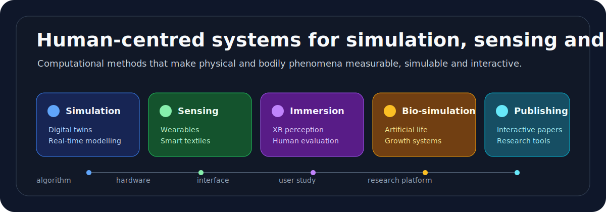

# Yitong Sun

Computer scientist, HCI researcher, and design-engineering practitioner building systems that make physical and bodily phenomena measurable, simulable, and interactive.

I work across human-computer interaction, real-time simulation, digital twins, wearable sensing, smart textiles, computer graphics, embedded systems, and design research. My projects often move between algorithm, hardware, interface, and user study: from high-fidelity disaster simulation and VR eye-related sensing, to soft body-adjacent interfaces, artificial life systems, open hardware, and experimental publishing tools.

Currently, I am a Visiting Scholar at MIT CSAIL, working on smart textiles and body-centred interactive systems, and the founding Editor-in-Chief and technical founder of interactives, an experimental journal and publishing platform for interactive academic authoring.

## Research Directions

| Direction | What I build | Representative work |
| --- | --- | --- |
| Simulation, digital twins, and real-time modelling | Interactive environments that make complex physical processes testable, legible, and useful for training or decision-making. | Unreal Engine earthquake simulation, VR spectral evaluation, synthetic data systems |
| Wearable sensing and smart textiles | Body-centred systems that combine sensing, electronics, soft materials, calibration, and intervention. | Posture monitoring, capacitive and EMG sensing, conductive flexible materials |
| HCI and immersive systems | Human-centred interfaces for perception, physiology, XR, visual comfort, and evaluative research. | VR lighting, colour shifting, periocular sensing, psychophysical/user studies |
| Computational life and bio-simulation | Generative systems for growth, morphology, semantic feedback, and artificial life. | Fungal morphology simulation, participatory evolution of artificial life systems |
| Interactive research infrastructure | Tools that reshape how research is authored, reviewed, published, and experienced. | interactives.pub, collaborative editing, embedded media, AI-assisted editorial workflows |

## Open Work

| Project | Role | Stack |
| --- | --- | --- |
| [OPSX-SX70](https://github.com/sunyitong/OPSX-SX70) | Open-source replacement core board for the Polaroid SX-70 instant camera. | RP2040, MicroPython, PCB design |
| [DeepMetricEye](https://github.com/sunyitong/DeepMetricEye) | Research code for metric depth estimation in periocular VR imagery. | PyTorch, Unreal Engine, MetaHuman |
| [FungalLight](https://github.com/sunyitong/FungalLight) | Fungal morphology simulation prototype for graphics, artificial life, and dynamic light-containment research. | Rust, Bevy |
| [interactives.pub](https://github.com/sunyitong/interactives.pub) | Open publishing platform for interactive papers, editorial review, collaborative authoring, and research media. | Next.js, TypeScript, Supabase, Prisma, Yjs |

## Selected Publications and Systems

- `CHI 2026` !nteractivesPub: Redistributing Author and Reader Effort through Interactive Academic Authoring
- `SIGGRAPH Asia 2025` Participatory Evolution of Artificial Life Systems via Semantic Feedback
- `TVCG 2025` Reducing Light-Stimulation with Preserved Color Fidelity for VR Displays
- `SIGGRAPH Asia 2024` [Exploring Fungal Morphology Simulation and Dynamic Light Containment](https://doi.org/10.1145/3680530.3695440)
- `Computers & Graphics 2024` Executing Realistic Earthquake Simulations in Unreal Engine with Material Calibration
- `ISMAR 2023` [DeepMetricEye: Metric Depth Estimation in Periocular VR Imagery](https://doi.org/10.1109/ISMAR59233.2023.00058)

## Technical Range

`TypeScript` `Next.js` `React` `Supabase` `Prisma` `Yjs` `Rust` `Bevy` `Python` `PyTorch` `Unreal Engine` `Embedded Systems` `RP2040` `MicroPython` `PCB Design` `Wearable Sensing` `Smart Textiles` `Computer Graphics`

## Links

- Portfolio: <https://www.yitongsun.com>
- GitHub: <https://github.com/sunyitong>
- interactives: <https://interactives.pub>
- Publications: <https://www.yitongsun.com/publications>
- Google Scholar: <https://scholar.google.com/citations?user=_a4SWqgAAAAJ>
- LinkedIn: <https://www.linkedin.com/in/yitong-sun-391596223>
- Contact: <hi@yitongsun.com>
